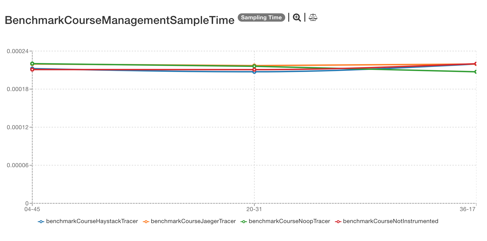
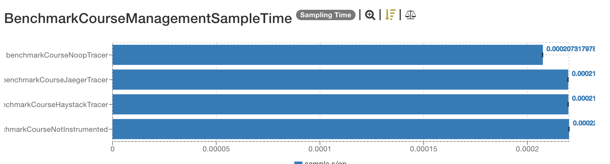
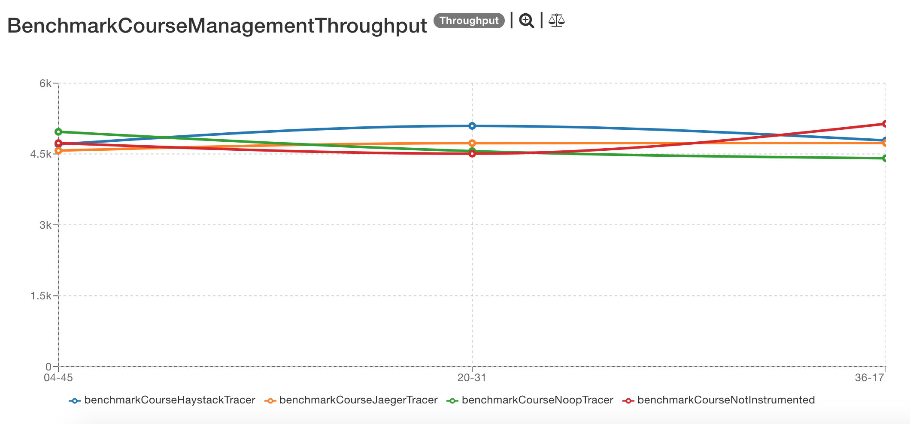
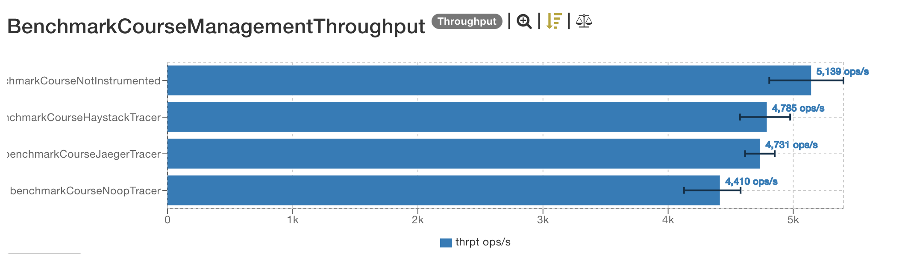

# Latest results

The latest results are located [here](http://jmh.morethan.io/?sources=https://raw.githubusercontent.com/gsoria/opentracing-java-benchmark/master/opentracing-benchmark-java-jaxrs/results/jmh-2019-04-07-16-04-45.json,https://raw.githubusercontent.com/gsoria/opentracing-java-benchmark/master/opentracing-benchmark-java-jaxrs/results/jmh-2019-04-07-16-20-31.json,https://raw.githubusercontent.com/gsoria/opentracing-java-benchmark/master/opentracing-benchmark-java-jaxrs/results/jmh-2019-04-07-16-36-17.json&topBar=Opentracing%20java%20jax-rs).
These graphics are constructed based on raw results located in the ``results`` folder.

## Description

These tests use a sample [jax-rs with spring boot application](https://github.com/tachuela700/course-management) containing a basic course management process.
This application exposes a JAX-RS endpoint for the [`CourseResource`](src/main/java/io/opentracing/contrib/benchmarks/course/resources/CourseResource.java).

The application is initialized for each test iteration in the [`BenchmarkCourseManagementBase`](src/main/java/io/opentracing/contrib/benchmarks/BenchmarkCourseManagementBase.java), 
and using profiles, the right tracer is injected in [`TracerConfiguration`](src/main/java/io/opentracing/contrib/benchmarks/config/TracerConfiguration.java).
The tracer is registered in `GlobalTracer` at startup using an application listener [`ExecutorListener`](src/main/java/io/opentracing/contrib/benchmarks/course/listener/ExecutorListener.java)

The tests consist of client rest call using unirest to get the list of all courses in a not instrumentation scenario and instrumented with different tracers. 

```java
Unirest.get("http://" + HOST + ":" + PORT + "/rest/course/").asString().getBody();

```

## Dependencies

This project uses this [Opentracing dependency](https://github.com/opentracing-contrib/java-jaxrs):
Adding this dependency on the classpath enable tracing automatically.

```xml

    <opentracing.version>0.31.0</opentracing.version>
    <jaeger.version>0.31.0</jaeger.version>
    <haystack.version>0.2.5</haystack.version>
	<opentracing.jaxrs2.discovery.version>0.4.1</opentracing.jaxrs2.discovery.version>

    <dependency>
        <groupId>io.opentracing.contrib</groupId>
        <artifactId>opentracing-jaxrs2-discovery</artifactId>
        <version>${opentracing.jaxrs2.discovery.version}</version>
    </dependency>
```

And for the different tracer implementations these dependencies:

```xml
    <dependency>
        <groupId>io.opentracing</groupId>
        <artifactId>opentracing-noop</artifactId>
        <version>${opentracing.version}</version>
    </dependency>
    <dependency>
        <groupId>io.opentracing</groupId>
        <artifactId>opentracing-mock</artifactId>
        <version>${opentracing.version}</version>
    </dependency>
    <dependency>
        <groupId>io.jaegertracing</groupId>
        <artifactId>jaeger-client</artifactId>
        <version>${jaeger.version}</version>
    </dependency>
    <dependency>
        <groupId>com.expedia.www</groupId>
        <artifactId>haystack-client-core</artifactId>
        <version>${haystack.version}</version>
    </dependency>
```

## SampleTime metrics

- X axis: represents each execution result.
- Y axis: represents how long time it takes for the benchmark method to execute.





## Throughput metrics

- X axis: represents each execution result.
- Y axis: represents of number of operations per second  (the number of times per second the benchmark method could be executed).





## Previous results
The previous results are located [here](results-md/previous.md).

## Environment
The tests were executed in a personal notebook with these characteristics:

- Model Name:	MacBook Pro
- Processor Name:	Intel Core i5
- Processor Speed:	2.6 GHz
- Number of Processors:	1
- Total Number of Cores:	2
- L2 Cache (per Core):	256 KB
- L3 Cache:	3 MB
- Memory:	8 GB
