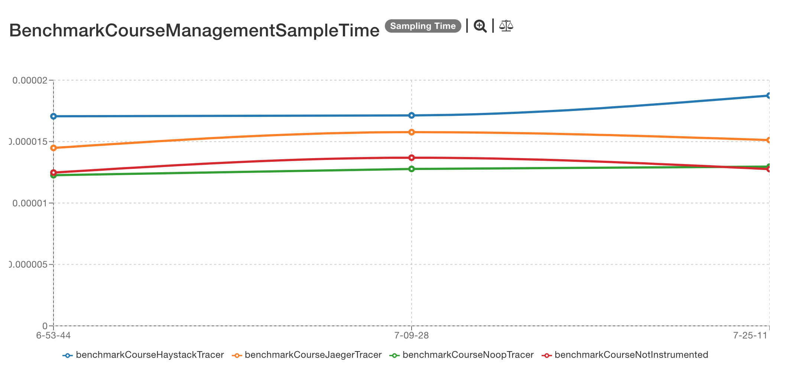
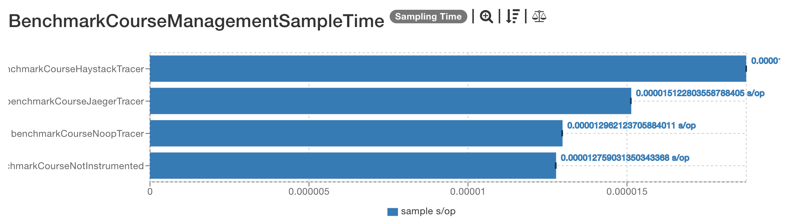
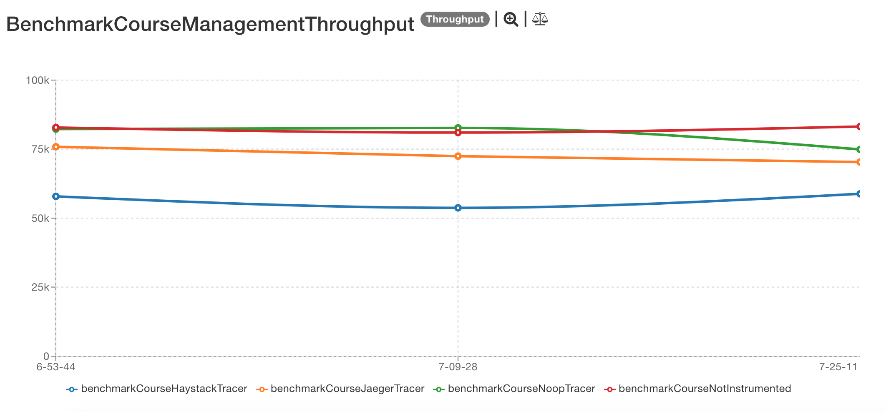
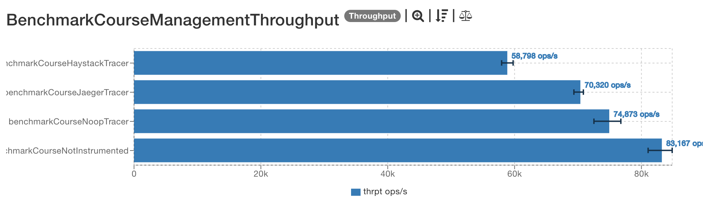
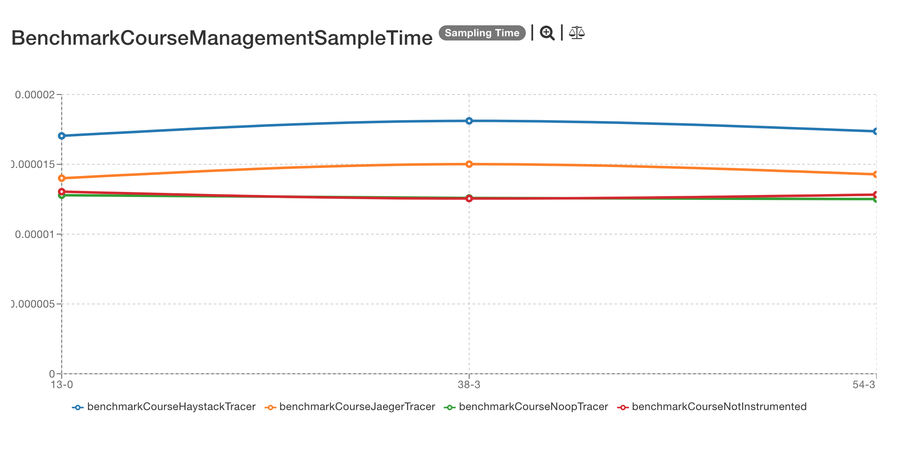
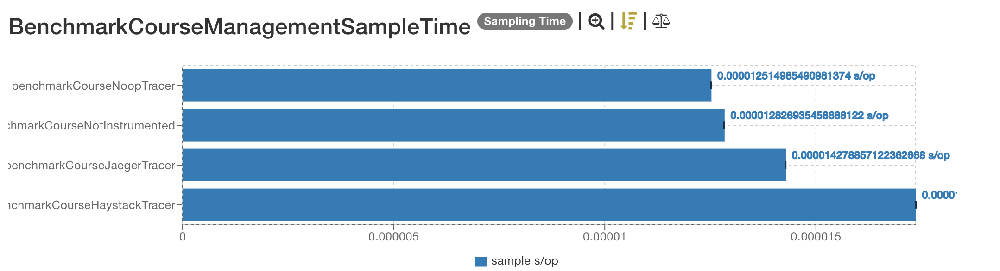
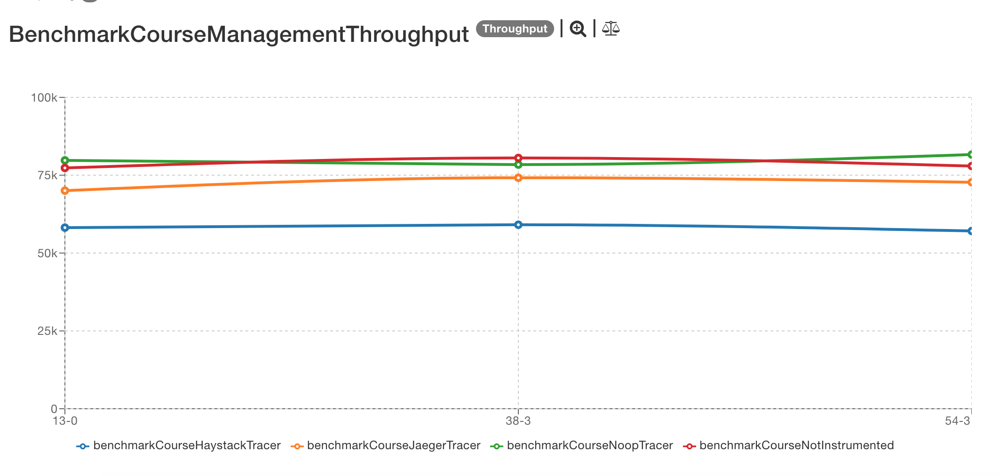
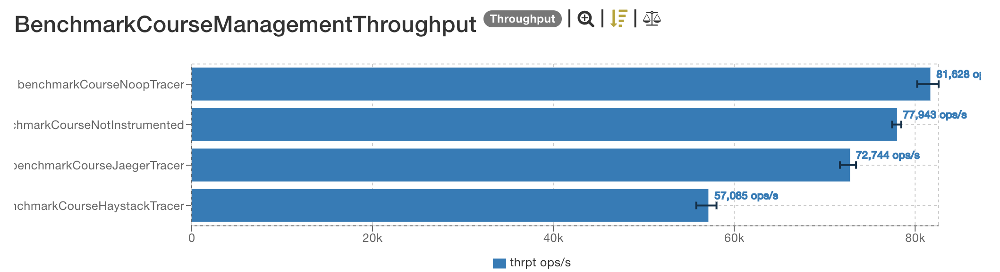

# Previous results

## 2019-04-07

The results are located [here](http://jmh.morethan.io/?sources=https://raw.githubusercontent.com/gsoria/opentracing-java-benchmark/master/opentracing-benchmark-java-jdbc/results/jmh-2019-04-07-16-53-44.json,https://raw.githubusercontent.com/gsoria/opentracing-java-benchmark/master/opentracing-benchmark-java-jdbc/results/jmh-2019-04-07-17-09-28.json,https://raw.githubusercontent.com/gsoria/opentracing-java-benchmark/master/opentracing-benchmark-java-jdbc/results/jmh-2019-04-07-17-25-11.json&topBar=Opentracing%20java%20jdbc).
These graphics are constructed based on raw results located in the ``results`` folder.

### SampleTime metrics

- X axis: represents each execution result.
- Y axis: represents how long time it takes for the benchmark method to execute.

### Throughput metrics

- X axis: represents each execution result.
- Y axis: represents of number of operations per second  (the number of times per second the benchmark method could be executed).

## 2019-03-27

The results are located [here](http://jmh.morethan.io/?sources=https://raw.githubusercontent.com/gsoria/opentracing-java-benchmark/master/opentracing-benchmark-java-jdbc/results/jmh-2019-03-27-08-13-01.json,https://raw.githubusercontent.com/gsoria/opentracing-java-benchmark/master/opentracing-benchmark-java-jdbc/results/jmh-2019-03-27-08-38-31.json,https://raw.githubusercontent.com/gsoria/opentracing-java-benchmark/master/opentracing-benchmark-java-jdbc/results/jmh-2019-03-27-08-54-31.json&topBar=Opentracing%20java%20jdbc).
These graphics are constructed based on raw results located in the ``results`` folder.

### SampleTime metrics

- X axis: represents each execution result.
- Y axis: represents how long time it takes for the benchmark method to execute.

### Throughput metrics

- X axis: represents each execution result.
- Y axis: represents of number of operations per second  (the number of times per second the benchmark method could be executed).

