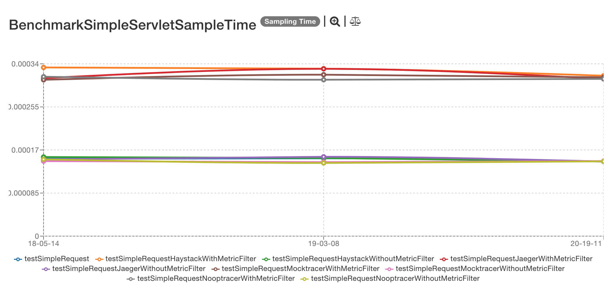
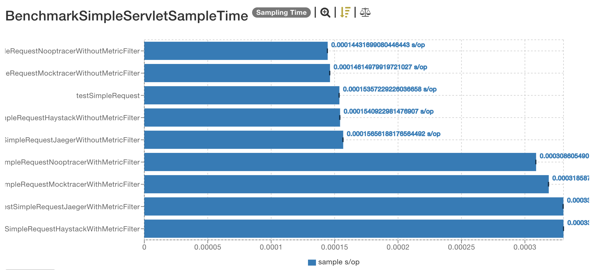
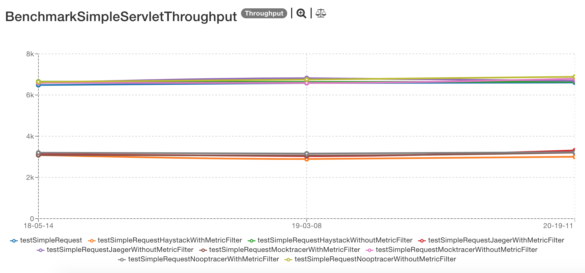
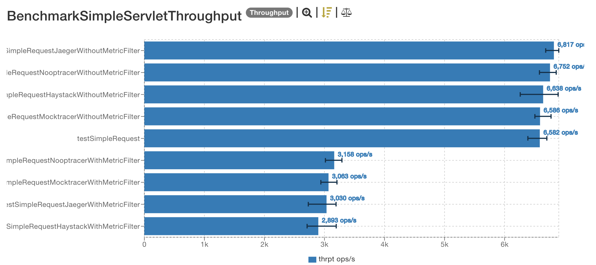

# Previous results

## 2013-03-25

The results are located [here](http://jmh.morethan.io/?sources=https://raw.githubusercontent.com/gsoria/opentracing-java-benchmark/master/opentracing-benchmark-java-servlet-filter/results/jmh-2019-03-25-18-05-14.json,https://raw.githubusercontent.com/gsoria/opentracing-java-benchmark/master/opentracing-benchmark-java-servlet-filter/results/jmh-2019-03-25-19-03-08.json,https://raw.githubusercontent.com/gsoria/opentracing-java-benchmark/master/opentracing-benchmark-java-servlet-filter/results/jmh-2019-03-25-20-19-11.json&topBar=Opentracing%20java%20servlet%20filter).
These graphics are constructed based on raw results located in the ``results`` folder.

## SampleTime metrics

- X axis: represents each execution result.
- Y axis: represents how long time it takes for the benchmark method to execute.

## Throughput metrics

- X axis: represents each execution result.
- Y axis: represents of number of operations per second  (the number of times per second the benchmark method could be executed).

