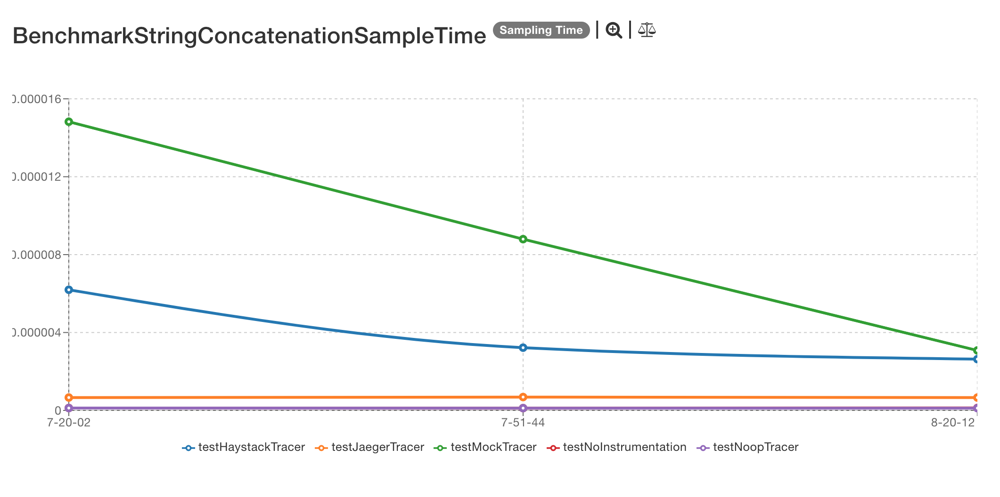
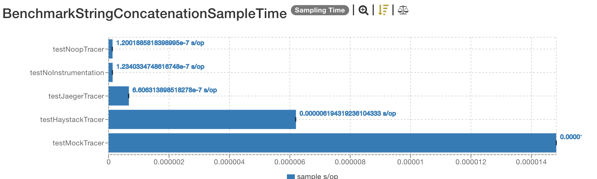
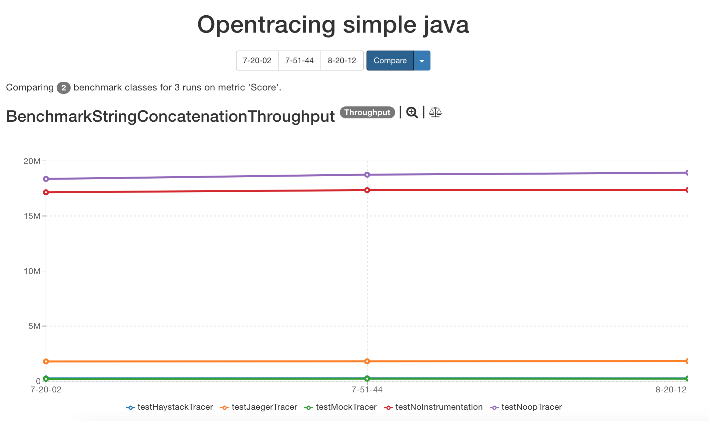
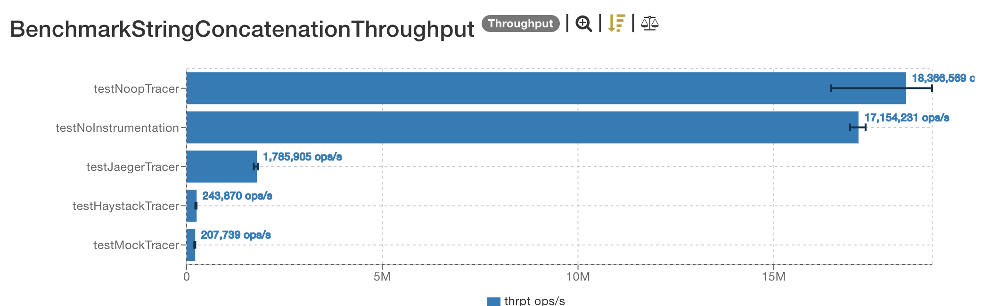

# Latest results

The latest result are located [here](http://jmh.morethan.io/?sources=https://raw.githubusercontent.com/gsoria/opentracing-java-benchmark/master/opentracing-benchmark-simple-java/results/jmh-2019-03-23-17-20-02.json,https://raw.githubusercontent.com/gsoria/opentracing-java-benchmark/master/opentracing-benchmark-simple-java/results/jmh-2019-03-23-17-51-44.json,https://raw.githubusercontent.com/gsoria/opentracing-java-benchmark/master/opentracing-benchmark-simple-java/results/jmh-2019-03-23-18-20-12.json&topBar=Opentracing simple java)

## SampleTime metrics

## Throughput metrics

## Environment
The tests were executed in a personal notebook with these characteristics:

- Model Name:	MacBook Pro
- Processor Name:	Intel Core i5
- Processor Speed:	2.6 GHz
- Number of Processors:	1
- Total Number of Cores:	2
- L2 Cache (per Core):	256 KB
- L3 Cache:	3 MB
- Memory:	8 GB

