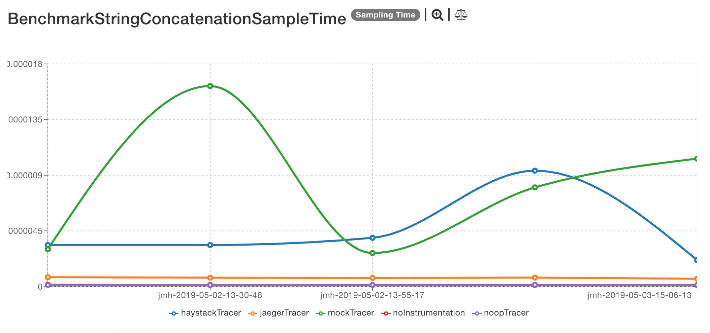
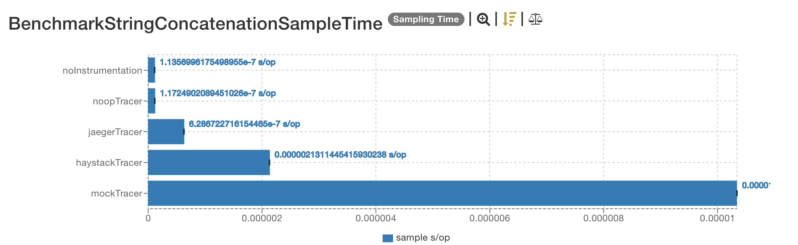
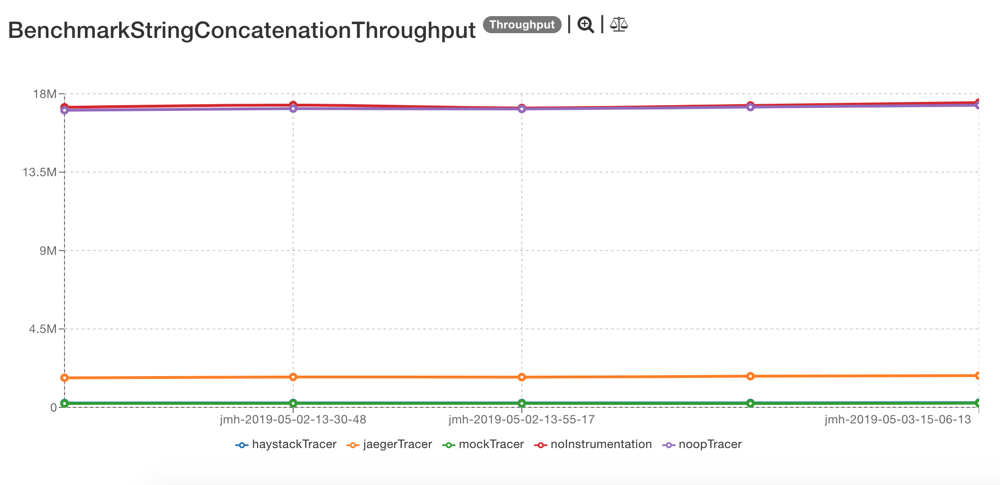
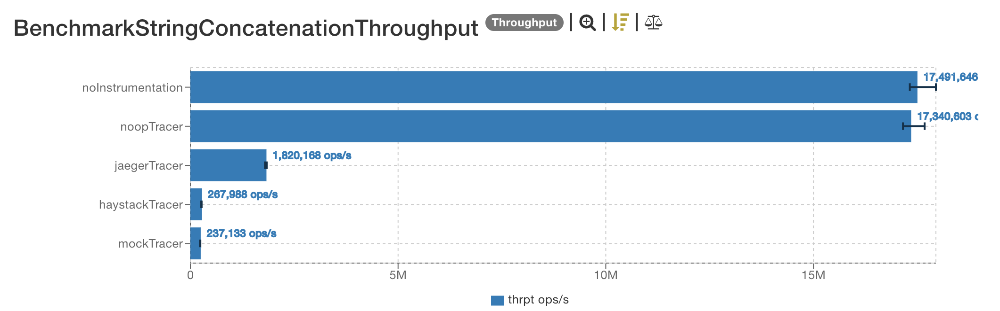

# Latest results

The latest results are located [here](http://jmh.morethan.io/?sources=https://raw.githubusercontent.com/gsoria/opentracing-java-benchmark/master/opentracing-benchmark-simple-java/results/jmh-2019-05-03-15-06-13.json,https://raw.githubusercontent.com/gsoria/opentracing-java-benchmark/master/opentracing-benchmark-simple-java/results/jmh-2019-05-02-14-16-33.json,https://raw.githubusercontent.com/gsoria/opentracing-java-benchmark/master/opentracing-benchmark-simple-java/results/jmh-2019-05-02-13-55-17.json,https://raw.githubusercontent.com/gsoria/opentracing-java-benchmark/master/opentracing-benchmark-simple-java/results/jmh-2019-05-02-13-30-48.json,https://raw.githubusercontent.com/gsoria/opentracing-java-benchmark/master/opentracing-benchmark-simple-java/results/jmh-2019-05-02-12-18-04.json&topBar=Opentracing%20simple%20java).
These graphics are constructed based on raw results located in the ``results`` folder.

## Description

These tests measure the cost of a simple string concatenation using two constant strings "Hello" and "world" with an iteration number i.
The tests are using instrumentation with the different tracers create a span, set a tag with the name of the tracers and log the resultant message of the concatenation.

## Dependencies

This project uses this [Opentracing dependency](https://github.com/opentracing/opentracing-java):

```xml
    <opentracing.version>0.31.0</opentracing.version>
    <jaeger.version>0.31.0</jaeger.version>
    <haystack.version>0.2.5</haystack.version>

    <dependency>
        <groupId>io.opentracing</groupId>
        <artifactId>opentracing-api</artifactId>
	    <version>${opentracing.version}</version>
    </dependency>
```

And for the different tracer implementations these dependencies:

```xml
    <dependency>
        <groupId>io.opentracing</groupId>
        <artifactId>opentracing-noop</artifactId>
        <version>${opentracing.version}</version>
    </dependency>
    <dependency>
        <groupId>io.opentracing</groupId>
        <artifactId>opentracing-mock</artifactId>
        <version>${opentracing.version}</version>
    </dependency>
    <dependency>
        <groupId>io.jaegertracing</groupId>
        <artifactId>jaeger-client</artifactId>
        <version>${jaeger.version}</version>
    </dependency>
    <dependency>
        <groupId>com.expedia.www</groupId>
        <artifactId>haystack-client-core</artifactId>
        <version>${haystack.version}</version>
    </dependency>
```

## SampleTime metrics

- X axis: represents each execution result.
- Y axis: represents how long time it takes for the benchmark method to execute.





## Throughput metrics

- X axis: represents each execution result.
- Y axis: represents of number of operations per second  (the number of times per second the benchmark method could be executed).





## Previous results
The previous results are located [here](results-md/previous.md).

## Environment
The tests were executed in a personal notebook with these characteristics:

- Model Name:	MacBook Pro
- Processor Name:	Intel Core i5
- Processor Speed:	2.6 GHz
- Number of Processors:	1
- Total Number of Cores:	2
- L2 Cache (per Core):	256 KB
- L3 Cache:	3 MB
- Memory:	8 GB

