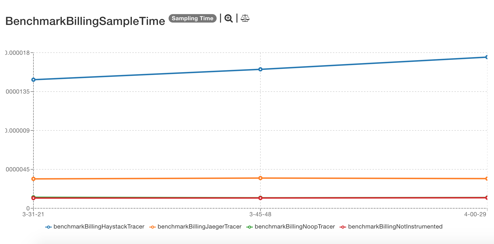
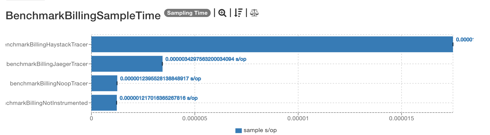
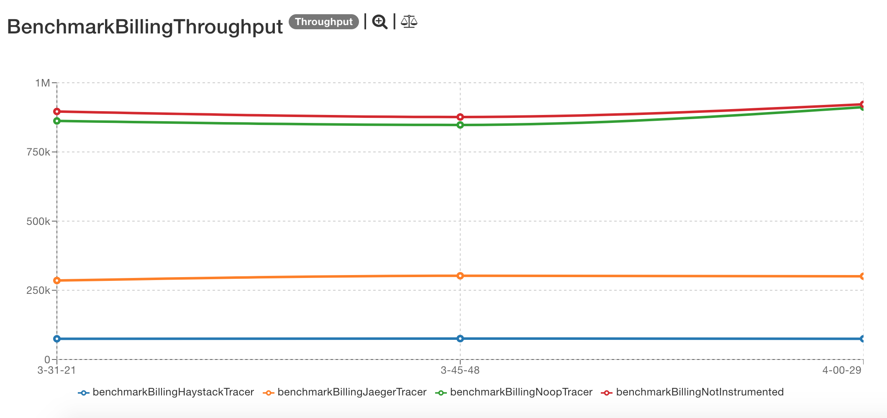
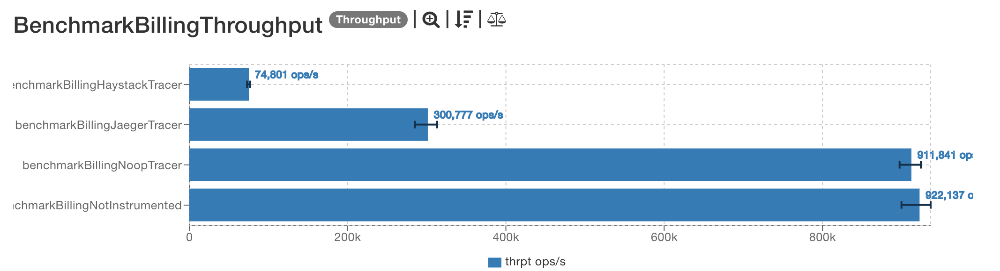

# Latest results

The latest results are located [here](http://jmh.morethan.io/?sources=https://raw.githubusercontent.com/gsoria/opentracing-java-benchmark/master/opentracing-benchmark-spring-boot/results/jmh-2019-04-07-13-31-21.json,https://raw.githubusercontent.com/gsoria/opentracing-java-benchmark/master/opentracing-benchmark-spring-boot/results/jmh-2019-04-07-13-45-48.json,https://raw.githubusercontent.com/gsoria/opentracing-java-benchmark/master/opentracing-benchmark-spring-boot/results/jmh-2019-04-07-14-00-29.json&topBar=Opentracing%20spring%20boot).
These graphics are constructed based on raw results located in the ``results`` folder.

## Description

These tests use an example spring boot application containing a basic billing process. The application is 
initialized for each test iteration in the [`StateVariables`](src/main/java/io/opentracing/contrib/benchmarks/BenchmarkBillingBase.java), 
and using profiles, the right tracer is injected in [`TracerConfiguration`](src/main/java/io/opentracing/contrib/benchmarks/config/TracerConfiguration.java) 
   
The different tests measure the process of issuing an invoice in a not instrumentation scenario and instrumented with different tracers. 
The tests are performing the operation calling to the Spring services directly.

Issue an invoice involves these steps:

- Create and invoice

In this step, in the [`TracedInvoiceService`](src/main/java/io/opentracing/contrib/benchmarks/billing/service/traced/TracedInvoiceService.java) it creates a span, set a tag with the customer's email and set a baggage item with the customer's tax id.

- Add line items

In this step, the invoice is retrieved from the repository by id, and the line item is added to it. 

- Issue an invoice

This step involves computing the invoice taxes, notify the customer and set the invoice date, due date, and change the invoice state. 

In the step of computing taxes, in [`TracedTaxService`](src/main/java/io/opentracing/contrib/benchmarks/billing/service/traced/TracedTaxService.java) an span is created, the taxId is retrieved from the span baggage and is set as a tag to the span and the name of the step is logged. The currency, total and the total of the invoice are setting as tags of the span too.

The step of notifying the customer in [`NotificationService`](src/main/java/io/opentracing/contrib/benchmarks/billing/service/traced/TracedNotificationService.java) creates a span and, and set the recipient address as a tag and the tax id (retrieved from the baggage) as a tag too.  

## Dependencies

This project uses this [Opentracing dependency](https://github.com/opentracing/opentracing-java):

```xml

    <opentracing.version>0.31.0</opentracing.version>
    <jaeger.version>0.31.0</jaeger.version>
    <haystack.version>0.2.5</haystack.version>

    <dependency>
        <groupId>io.opentracing</groupId>
        <artifactId>opentracing-api</artifactId>
	    <version>${opentracing.version}</version>
    </dependency>
```

And for the different tracer implementations these dependencies:

```xml
    <dependency>
        <groupId>io.opentracing</groupId>
        <artifactId>opentracing-noop</artifactId>
        <version>${opentracing.version}</version>
    </dependency>
    <dependency>
        <groupId>io.opentracing</groupId>
        <artifactId>opentracing-mock</artifactId>
        <version>${opentracing.version}</version>
    </dependency>
    <dependency>
        <groupId>io.jaegertracing</groupId>
        <artifactId>jaeger-client</artifactId>
        <version>${jaeger.version}</version>
    </dependency>
    <dependency>
        <groupId>com.expedia.www</groupId>
        <artifactId>haystack-client-core</artifactId>
        <version>${haystack.version}</version>
    </dependency>
```

## SampleTime metrics

- X axis: represents each execution result.
- Y axis: represents how long time it takes for the benchmark method to execute.





## Throughput metrics

- X axis: represents each execution result.
- Y axis: represents of number of operations per second  (the number of times per second the benchmark method could be executed).





## Previous results
The previous results are located [here](results-md/previous.md).

## Environment
The tests were executed in a personal notebook with these characteristics:

- Model Name:	MacBook Pro
- Processor Name:	Intel Core i5
- Processor Speed:	2.6 GHz
- Number of Processors:	1
- Total Number of Cores:	2
- L2 Cache (per Core):	256 KB
- L3 Cache:	3 MB
- Memory:	8 GB

