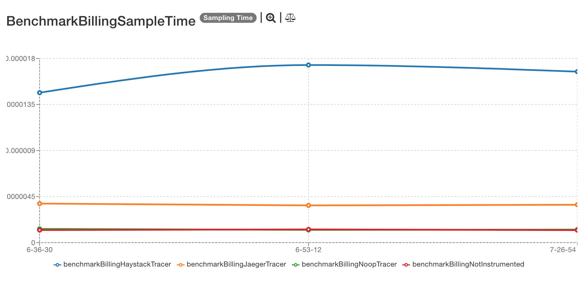
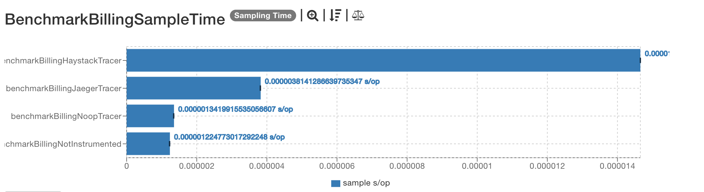
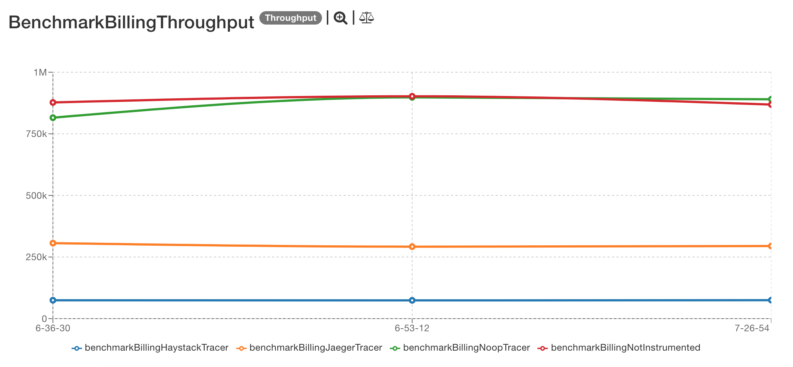
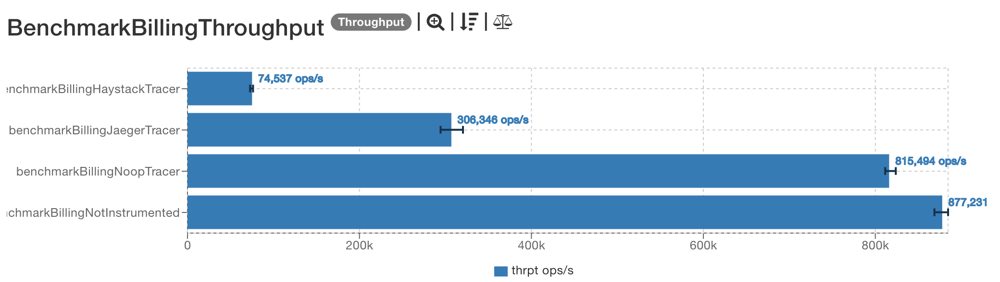

# Previous results

## 2019-04-07

The results are located [here](http://jmh.morethan.io/?sources=https://raw.githubusercontent.com/gsoria/opentracing-java-benchmark/master/opentracing-benchmark-spring-boot/results/jmh-2019-04-07-13-31-21.json,https://raw.githubusercontent.com/gsoria/opentracing-java-benchmark/master/opentracing-benchmark-spring-boot/results/jmh-2019-04-07-13-45-48.json,https://raw.githubusercontent.com/gsoria/opentracing-java-benchmark/master/opentracing-benchmark-spring-boot/results/jmh-2019-04-07-14-00-29.json&topBar=Opentracing%20spring%20boot).
These graphics are constructed based on raw results located in the ``results`` folder.

### SampleTime metrics

- X axis: represents each execution result.
- Y axis: represents how long time it takes for the benchmark method to execute.

### Throughput metrics

- X axis: represents each execution result.
- Y axis: represents of number of operations per second  (the number of times per second the benchmark method could be executed).

## 2019-03-25

The results are located [here](http://jmh.morethan.io/?sources=https://raw.githubusercontent.com/gsoria/opentracing-java-benchmark/master/opentracing-benchmark-spring-boot/results/jmh-2019-03-25-16-36-30.json,https://raw.githubusercontent.com/gsoria/opentracing-java-benchmark/master/opentracing-benchmark-spring-boot/results/jmh-2019-03-25-16-53-12.json,https://raw.githubusercontent.com/gsoria/opentracing-java-benchmark/master/opentracing-benchmark-spring-boot/results/jmh-2019-03-25-17-26-54.json&topBar=Opentracing%20spring%20boot).
These graphics are constructed based on raw results located in the ``results`` folder.

### SampleTime metrics

- X axis: represents each execution result.
- Y axis: represents how long time it takes for the benchmark method to execute.

### Throughput metrics

- X axis: represents each execution result.
- Y axis: represents of number of operations per second  (the number of times per second the benchmark method could be executed).

