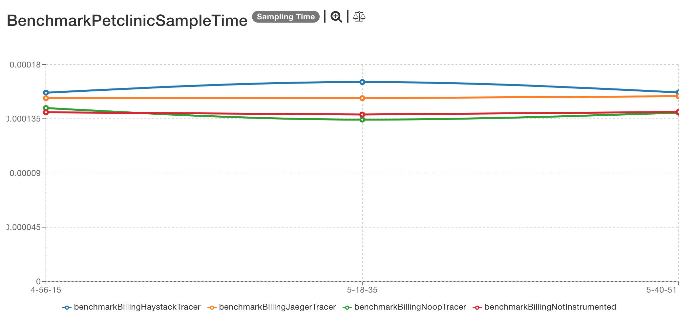
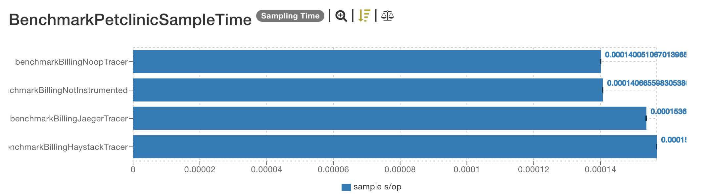
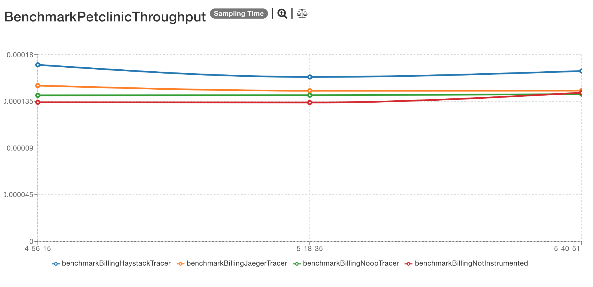
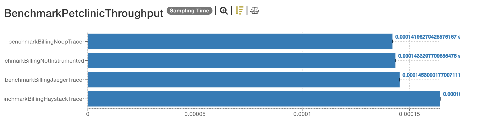
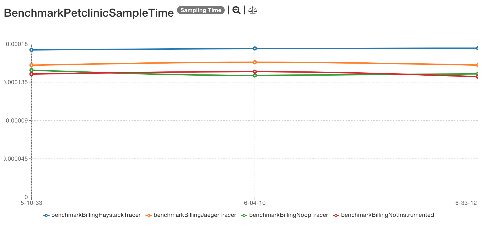
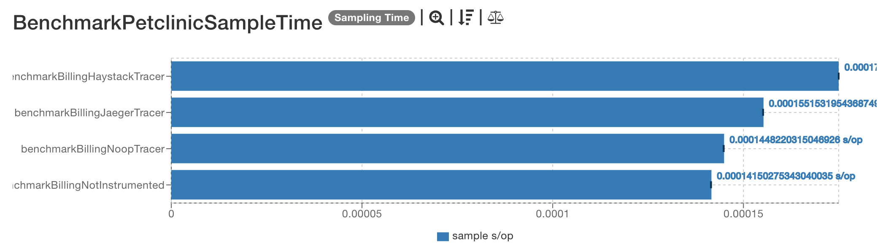
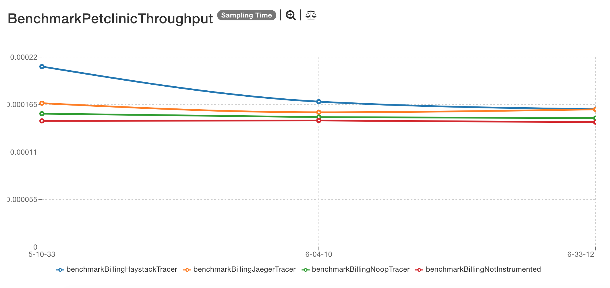
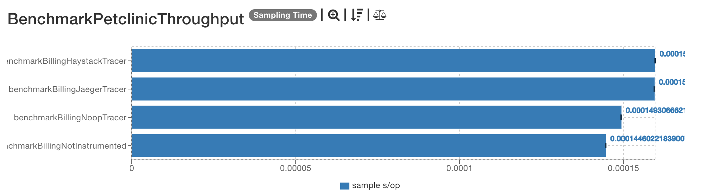

# Previous results

## 2013-04-07

The results are located [here](http://jmh.morethan.io/?sources=https://raw.githubusercontent.com/gsoria/opentracing-java-benchmark/master/opentracing-benchmark-spring-cloud/results/jmh-2019-04-07-14-56-15.json,https://raw.githubusercontent.com/gsoria/opentracing-java-benchmark/master/opentracing-benchmark-spring-cloud/results/jmh-2019-04-07-15-18-35.json,https://raw.githubusercontent.com/gsoria/opentracing-java-benchmark/master/opentracing-benchmark-spring-cloud/results/jmh-2019-04-07-15-40-51.json&topBar=Opentracing%20spring%20cloud).
These graphics are constructed based on raw results located in the ``results`` folder.

### SampleTime metrics

- X axis: represents each execution result.
- Y axis: represents how long time it takes for the benchmark method to execute.

### Throughput metrics

- X axis: represents each execution result.
- Y axis: represents of number of operations per second  (the number of times per second the benchmark method could be executed).

## 2013-03-26

The results are located [here](http://jmh.morethan.io/?sources=https://raw.githubusercontent.com/gsoria/opentracing-java-benchmark/master/opentracing-benchmark-spring-cloud/results/jmh-2019-03-26-15-10-33.json,https://raw.githubusercontent.com/gsoria/opentracing-java-benchmark/master/opentracing-benchmark-spring-cloud/results/jmh-2019-03-26-16-04-10.json,https://raw.githubusercontent.com/gsoria/opentracing-java-benchmark/master/opentracing-benchmark-spring-cloud/results/jmh-2019-03-26-16-33-12.json&topBar=Opentracing%20spring%20cloud).
These graphics are constructed based on raw results located in the ``results`` folder.

### SampleTime metrics

- X axis: represents each execution result.
- Y axis: represents how long time it takes for the benchmark method to execute.

### Throughput metrics

- X axis: represents each execution result.
- Y axis: represents of number of operations per second  (the number of times per second the benchmark method could be executed).

